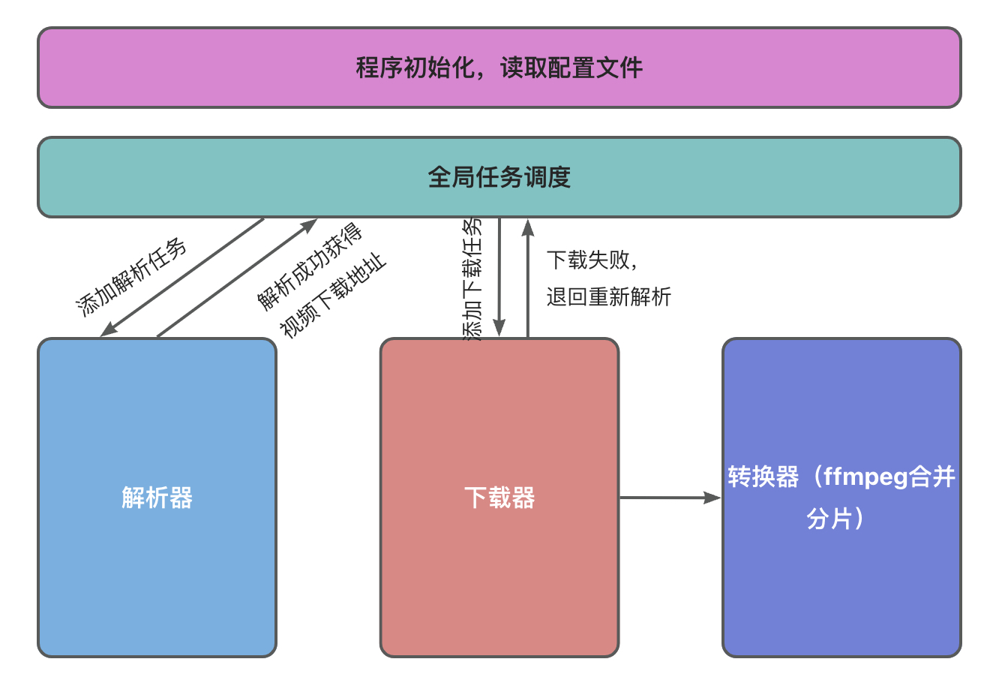
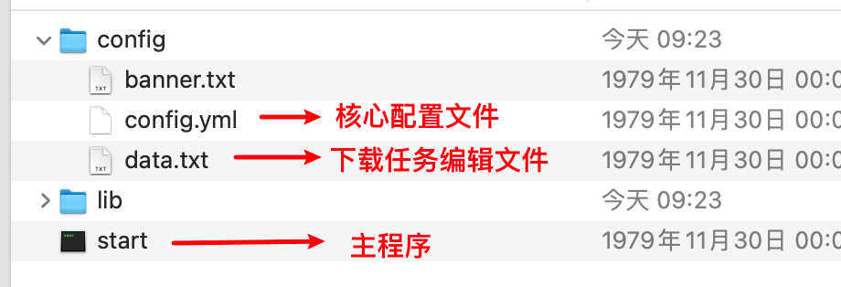
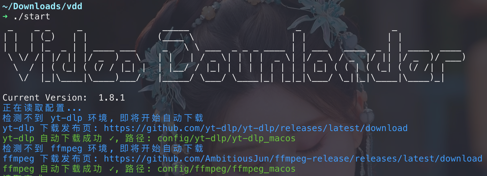
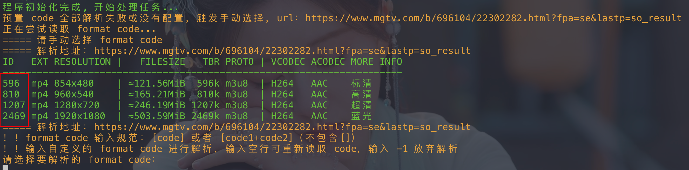
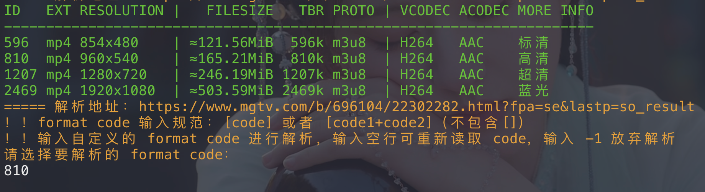
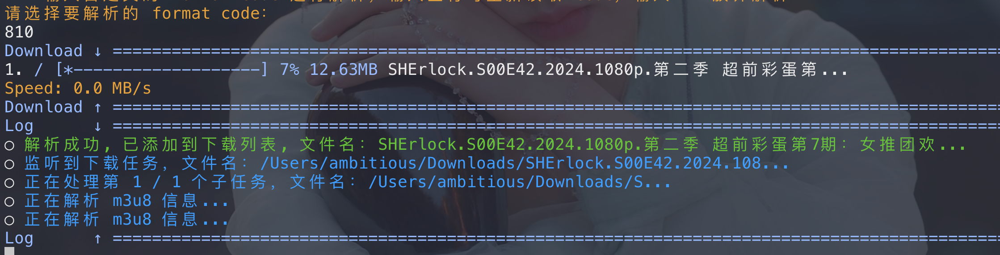
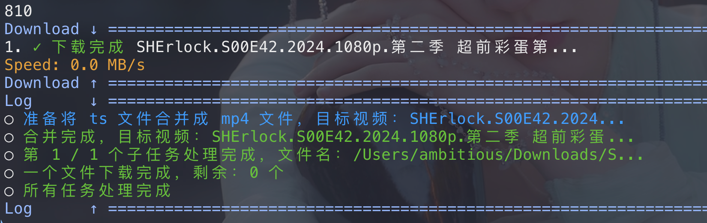
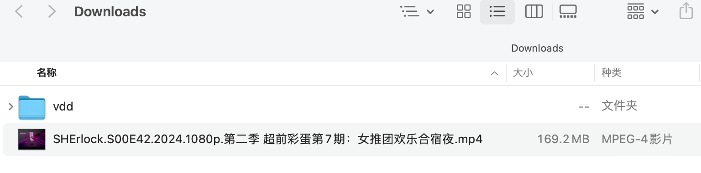
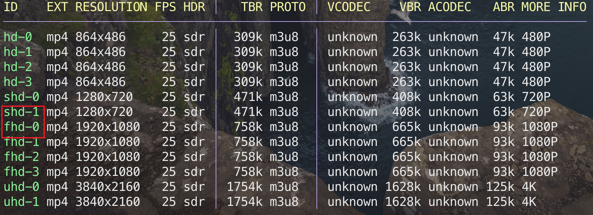
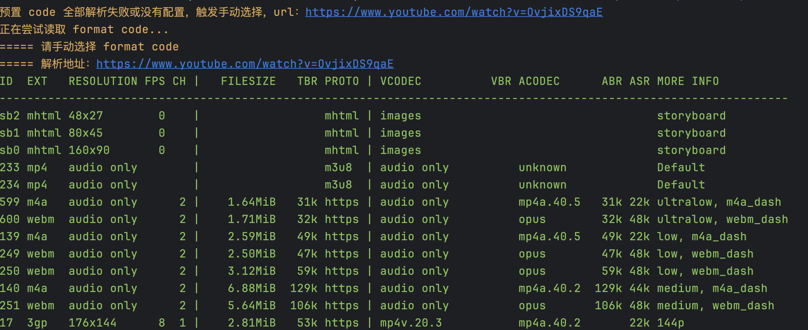

<h1 align="center">video-downloader-go</h1>

<div align="center">
  <a href="https://github.com/AmbitiousJun/video-downloader-go/tree/v1.8.8"></img></a>
  <a href="https://goreportcard.com/report/github.com/AmbitiousJun/video-downloader-go"></img></a>
  <a href="https://github.com/AmbitiousJun/video-downloader-go/releases/latest"></img></a>
  </img>
</div>

<div align="center">
  “爱优腾芒” 视频批量解析下载器，适配 macos / windows / linux
</div>

## 特点

1. 打包之后体积更小，无需 JVM 环境也能使用

2. 采用 [chromedp](https://github.com/chromedp/chromedp?tab=readme-ov-file) 作为替代 Selenium 的解决方案，目前实现了 Tx 解析器

3. 美化终端输出

## 概述

使用 Go 语言编写的多线程视频下载器，适配 “爱优腾芒”。开发这个项目的目的就是为了**批量下载**视频的时候解放双手，不需要手动转换 m3u8，也不需要等到视频下载完成之后再去一个一个改名。

一句话总结这个项目：类似 docker-compose，本项目就是将下载的任务以及下载方式提前通过配置的方式编排好，然后启动程序自动下载。

## 适用场景

- 多线程批量下载视频
- 文件名称提前配置
- 自动将 ts 切片合并成 mp4
- **需要给视频文件标准命名以生成海报墙**（Emby, Jellyfin, Infuse, Kodi）



## 技术栈

- Go

## 快速开始

> 示例：使用 `youtube-dl` 解析器下载一个 MG 的视频

1. 在 [发布页](https://github.com/AmbitiousJun/video-downloader-go/releases/latest) 下载好适用于自己系统的压缩包，解压得到以下文件

   

2. 打开终端，进入主程序（start）所在的目录下，直接运行程序，自动初始化好 `ffmpeg` 和 `yt-dlp` 的执行环境

   > 确保本地能够正常连通 github，否则有可能会初始化失败

   

3. 按下键盘快捷键 `Ctrl+C` 停止程序，然后打开 `data.txt` 文件编辑下载任务如下

   > 任务文件编辑格式如下：
   >
   > 1. 每行一个任务
   > 2. 每个任务由三部分组成
   >    - 文件名
   >    - 分隔符（`|`）
   >    - 视频网址
   > 3. 确保文件名和视频网址中都不能含有分隔符，否则程序会处理错误

   ```
   SHErlock.S00E42.2024.1080p.第二季 超前彩蛋第7期：女推团欢乐合宿夜|https://www.mgtv.com/b/696104/22302282.html?fpa=se&lastp=so_result
   ```

4. 打开 `config.yml` 文件编辑下载配置

   > 配置文件仅保留必填项以及适用于本下载示例的部分配置，更详细的配置方法请参照 [示例](https://github.com/AmbitiousJun/video-downloader-go?tab=readme-ov-file#示例)

   - 解析器（decoder）配置

     ```yaml
     decoder:
       use: youtube-dl # 使用哪种解析方式，可选值：none, youtube-dl, cat-catch:tx
       max-retry: 5 # 最大的尝试解析次数
       youtube-dl: # youtube-dl 解析器相关配置
         cookies-from: chrome # 从哪个浏览器获取 cookie，推荐 firefox，该参数会直接传递给 youtube-dl，传入 none 则忽略
         remember-format: -1 # 是否记住视频格式，程序自动根据 host 进行区分，每次启动程序时缓存都会重置，可选值：-1, 1
       cat-catch: # 猫抓解析器
         headless: 1 # 是否开启无头模式, 可选值: -1, 1
     ```

   - 下载器（downloader）配置

     ```yaml
     downloader:
       use: multi-thread # 要使用哪个下载器，可选值：simple, multi-thread
       task-thread-count: 2 # 处理下载任务的线程个数
       dl-thread-count: 12 # 多线程下载的线程个数
       download-dir: /Users/ambitious/Downloads # 视频文件下载位置
       # download-dir: C:/Users/Ambitious/Downloads # 视频文件下载位置
       ts-dir-suffix: temp_ts_files # 暂存 ts 文件的目录后缀
       rate-limit: 10mbps # 下载限速，两种单位可选：mbps, kbps，-1 则不限速
     ```

5. 完整的配置文件如下

   ```yaml
   # 解析器配置
   #
   # 注：在 windows 平台下使用 youtube-dl 解析器时，从 chrome, edge 等浏览器获取 cookie 有可能会失败，换成 firefox 即可
   decoder:
     use: youtube-dl # 使用哪种解析方式，可选值：none, youtube-dl, cat-catch:tx
     max-retry: 5 # 最大的尝试解析次数
     youtube-dl: # youtube-dl 解析器相关配置
       cookies-from: chrome # 从哪个浏览器获取 cookie，推荐 firefox，该参数会直接传递给 youtube-dl，传入 none 则忽略
       remember-format: -1 # 是否记住视频格式，程序自动根据 host 进行区分，每次启动程序时缓存都会重置，可选值：-1, 1
     cat-catch: # 猫抓解析器
       headless: 1 # 是否开启无头模式, 可选值: -1, 1
   
   # 下载器配置
   downloader:
     use: multi-thread # 要使用哪个下载器，可选值：simple, multi-thread
     task-thread-count: 2 # 处理下载任务的线程个数
     dl-thread-count: 12 # 多线程下载的线程个数
     download-dir: /Users/ambitious/Downloads # 视频文件下载位置
     # download-dir: C:/Users/Ambitious/Downloads # 视频文件下载位置
     ts-dir-suffix: temp_ts_files # 暂存 ts 文件的目录后缀
     rate-limit: 10mbps # 下载限速，两种单位可选：mbps, kbps，-1 则不限速
   
   # ts 转换器配置
   #
   # 对于不同的 m3u8, 有的转换器合并后的视频文件会有跳帧问题，可以尝试更换转换器
   transfer:
     use: ffmpeg_str_v2 # 要选用哪个转码器，可选值：ffmpeg_str, ffmpeg_txt, ffmpeg_str_v2
     ts-filename-regex: _(\d+)\. # 正则表达式，用于匹配出 ts 文件的序号
   ```

6. 回到终端，运行程序，开始下载

   

   程序自动调用 `yt-dlp` 解析出了 4 个视频信息（需要在 chrome 登录 vip 账号才能解析出蓝光）
   
   最左边的 `ID` 列即为最终需要传递给程序的 format code
   
   以 `960x540` 为例，需要将 format code `810` 输入到终端后回车继续下载
   
   
   
   待解析成功后，程序就会自动下载并合并视频到指定目录下，期间会实时显示下载进度
   
   
   
   下载成功 ✅
   
   

   

## 示例

1. 不使用解析器，多线程下载 mp4 格式视频

data.txt:

```shell
这是一个视频|https://example.com/test.mp4
```

config.yml:

```yml
decoder: # 解码器相关配置
  use: none # 使用哪种解析方式，可选值：none, free-api, vip-fetch, youtube-dl，若使用 youtube-dl，resource-type 会被忽略
  resource-type: mp4 # 解析出来的文件类型，可选值：mp4, m3u8

downloader:
  use: multi-thread # 要使用哪个下载器，可选值：simple, multi-thread
  task-thread-count: 1 # 处理下载任务的线程个数
  dl-thread-count: 32 # 多线程下载的线程个数
  download-dir: /Users/ambitious/Downloads # 视频文件下载位置
  ts-dir-suffix: temp_ts_files # 暂存 ts 文件的目录后缀【保持默认即可】
```

2. 不使用解析器，多线程下载 m3u8 视频，并自动合并为 mp4

data.txt:

```shell
这是一个视频|https://example.com/test.m3u8
```

config.yml:

```yml
decoder: # 解码器相关配置
  use: none # 使用哪种解析方式，可选值：none, free-api, vip-fetch, youtube-dl，若使用 youtube-dl，resource-type 会被忽略
  resource-type: m3u8 # 解析出来的文件类型，可选值：mp4, m3u8

downloader:
  use: multi-thread # 要使用哪个下载器，可选值：simple, multi-thread
  task-thread-count: 1 # 处理下载任务的线程个数
  dl-thread-count: 32 # 多线程下载的线程个数
  download-dir: /Users/ambitious/Downloads # 视频文件下载位置
  ts-dir-suffix: temp_ts_files # 暂存 ts 文件的目录后缀

transfer:
  use: ffmpeg # 要选用哪个转码器，可选值：file-channel, cv, ffmpeg【保持ffmpeg不变即可】
  ts-filename-regex: (?<=_)(\d+)(?=\.) # 正则表达式，用于匹配出 ts 文件的序号
```

3. 已有 “爱优腾芒” 等视频网站的会员，需要批量下载网站上的视频

data.txt:

```shell
开始推理吧.S01E01|https://v.qq.com/x/cover/mzc00200ynivua7/r00434mq14v.html
开始推理吧.S01E02|https://v.qq.com/x/cover/mzc00200ynivua7/r00434mq14v.html
开始推理吧.S01E03|https://v.qq.com/x/cover/mzc00200ynivua7/r00434mq14v.html
开始推理吧.S01E04|https://v.qq.com/x/cover/mzc00200ynivua7/r00434mq14v.html
开始推理吧.S01E05|https://v.qq.com/x/cover/mzc00200ynivua7/r00434mq14v.html
开始推理吧.S01E06|https://v.qq.com/x/cover/mzc00200ynivua7/r00434mq14v.html
开始推理吧.S01E07|https://v.qq.com/x/cover/mzc00200ynivua7/r00434mq14v.html
开始推理吧.S01E08|https://v.qq.com/x/cover/mzc00200ynivua7/r00434mq14v.html
开始推理吧.S01E09|https://v.qq.com/x/cover/mzc00200ynivua7/r00434mq14v.html
开始推理吧.S01E10|https://v.qq.com/x/cover/mzc00200ynivua7/r00434mq14v.html
```

仍然是以 TX 为例，首先选取要下载的视频格式，在终端上运行：

```shell
youtube-dl -F "https://v.qq.com/x/cover/mzc00200ynivua7/r00434mq14v.html" --cookies-from-browser chrome
```

如果是会员才能观看的视频，需要先在浏览器登录会员账号，并注入 cookie，我这里以 chrome 为例，运行结果：



我想优先下载 1080p 格式，如果该格式下载失败的话，就下载 720p 的，那么配置文件这么写：

config.yml:

```yml
decoder: # 解码器相关配置
  use: youtube-dl # 使用哪种解析方式，可选值：none, free-api, vip-fetch, youtube-dl，若使用 youtube-dl，resource-type 会被忽略
  youtube-dl: # youtube-dl 解析器相关配置
    cookies-from: chrome # 从哪个浏览器获取 cookie，该参数会直接传递给 youtube-dl，传入 none 则忽略
    format-codes: # 下载视频的编码，可传多个，按照顺序进行解析，两种格式：'视频编码+音频编码' 或者 '视频编码'，只会下载首次解析成功的格式
      - fhd-0
      - shd-1

downloader:
  use: multi-thread # 要使用哪个下载器，可选值：simple, multi-thread
  task-thread-count: 1 # 处理下载任务的线程个数
  dl-thread-count: 32 # 多线程下载的线程个数
  download-dir: /Users/ambitious/Downloads # 视频文件下载位置
  ts-dir-suffix: temp_ts_files # 暂存 ts 文件的目录后缀

transfer:
  use: ffmpeg # 要选用哪个转码器，可选值：file-channel, cv, ffmpeg
  ts-filename-regex: (?<=_)(\d+)(?=\.) # 正则表达式，用于匹配出 ts 文件的序号
```

6. 已有 “爱优腾芒” 等视频网站的会员，需要批量下载网站上的视频，但是要下载的视频太多，懒得自己一个一个获取 format code

大多数视频网站中，通常情况下相同系列的视频相同格式它的 format code 是一样的，只需提前配置好一个 format code，就能解析下载全部视频。

但是像 **MG** 就不行了，每个视频的 format code 都是随机的，要下载 40 个视频，就要手动获取 40 个 format code，**非常地不银杏**。

这个时候就可以用到程序的自动获取 format code 功能了，当 config.yml 中配置的 format code 全部解析失败时，会触发这个逻辑：



如果不想要自己提前手动获取 format code，那么 config.yml 中，`decoder.youtube-dl.format-codes` 配置就不需要传递任何内容，像这样：

```yml
decoder: # 解码器相关配置
  use: youtube-dl # 使用哪种解析方式，可选值：none, free-api, vip-fetch, youtube-dl，若使用 youtube-dl，resource-type 会被忽略
  youtube-dl: # youtube-dl 解析器相关配置
    cookies-from: chrome # 从哪个浏览器获取 cookie，该参数会直接传递给 youtube-dl，传入 none 则忽略
    format-codes: # 下载视频的编码，可传多个，按照顺序进行解析，两种格式：'视频编码+音频编码' 或者 '视频编码'，只会下载首次解析成功的格式
```

有的时候会因为网络问题导致 format code 生成异常，可以直接敲回车重新获取。


**记住已选择的视频格式：**

批量下载 MG 上的视频时，尽管程序已经提供了自动读取 format code 功能，但是当下载量较大时，还是需要人为频繁地手动输入 format code。

这时可以将 `decoder.youtube-dl.remember-format` 配置设置成 `1`，开启记住已选择的视频格式。


```yml
decoder:
  use: none # 使用哪种解析方式，可选值：none, youtube-dl，若使用 youtube-dl，resource-type 会被忽略
  resource-type: m3u8 # 解析出来的文件类型，可选值：mp4, m3u8
  youtube-dl: # youtube-dl 解析器相关配置
    cookies-from: firefox # 从哪个浏览器获取 cookie，推荐 firefox，该参数会直接传递给 youtube-dl，传入 none 则忽略
    format-codes: # 下载视频的编码，可传多个，按照顺序进行解析，两种格式：'视频编码+音频编码' 或者 '视频编码'，只会下载首次解析成功的格式，可以不传此参数，在程序执行时手动选择
    remember-format: 1 # 是否记住视频格式，程序自动根据 host 进行区分，每次启动程序时缓存都会重置，可选值：-1, 1
```


程序会在用户第一次输入 format code 的时候，记住该视频格式（自动根据 url host 进行区分），

在之后读取 format code 的时候，程序会自动进行匹配，匹配成功则自动进行解析，若失败，则依旧是手动输入。

> 有的网站使用 youtube-dl 解析出来的视频格式中，不同的 format code 的格式是一样的，程序会按照从上到下按顺序匹配，并使用最先匹配到的结果。


7. 对不同的网站进行定制化配置

如果想要不同的网站下载任务同时开始进行，而不同网站使用的解析器又不相同，或者不完全相同时，可以采用定制化配置，通过 `host` 来区分配置。

可以在 `customs`  属性中配置多个定制化配置，在 `customs.hosts` 属性下配置要匹配的域名，参考配置如下：


```yml
# 针对不同的域名进行定制化配置
# 
# 针对 decoder 进行定制化配置
# 可配置的属性：use, resource-type, youtube-dl.cookies-from, youtube-dl.format-codes, youtube-dl.remember-format
#
# 针对 transfer 进行定制化配置
# 可配置的属性：use
customs:
  - decoder: 
      use: youtube-dl
      youtube-dl:
        cookies-from: chrome
        format-codes:
        remember-format: 1
    hosts: # 对哪些域名生效，必须配置完整，有端口也要加上
      - www.mgtv.com
      - www.youtube.com
      - www.bilibili.com
  - decoder:
      use: none
    hosts:
      - apd-vlive.apdcdn.tc.qq.com
      - pcvideoaliyun.titan.mgtv.com
      - pcvideotx.titan.mgtv.com
```

> 注：目前仅支持对解析器进行定制化配置

8. 使用猫抓解析器解析 Tx 资源

借助 [chromedp](https://github.com/chromedp/chromedp?tab=readme-ov-file) 和 [cat-catch](https://github.com/xifangczy/cat-catch) 实现了一个 Tx 资源解析器 (cat-catch:tx)，下面介绍一下怎么使用

> 注：
> 1. 该解析器依赖于 Chrome 浏览器
> 2. 该解析器在 video-downloader-go `v1.3.0` 版本之后加入支持
> 3. 建议迫不得已情况下才使用猫抓解析器，因为失败率较高

首先，Chrome 浏览器安装好 `EditThisCookie` 插件（没有科学上网环境的话用 Edge 浏览器也可以）


接着，打开 TX 首页，登录账号

登录完成后刷新页面

点击 `EditThisCookie` 插件，会展示出当前网站下的 Cookie 数据：


点击工具栏最右侧的 `扳手🔧` 图标，进入插件设置页面

点击左侧的选项栏，将 Cookie 导出格式设置为 JSON 格式：


回到 TX 网站页面，这里有一个注意点，在 `EditThisCookie` 插件弹框中，默认抓取的是 `v.qq.com` 域名下的 Cookie，只使用它们不足以恢复登录态，需要手动编辑输入框，去掉 `v.` 二级域名前缀，这时显示的 Cookie 信息才是完整的：


点击插件工具栏倒数第三个按钮，将 Cookie 信息导出到剪贴板中，新建一个文本文件，将 Cookie 信息粘贴进去即可，可先将该文件的 **绝对路径** 保存下来备用

在 video-downloader-go 的配置文件下，修改解析器的配置如下：

```yml
# 解析器配置
#
# 注：在 windows 平台下使用 youtube-dl 解析器时，从 chrome, edge 等浏览器获取 cookie 有可能会失败，换成 firefox 即可
decoder:
  use: cat-catch:tx # 使用哪种解析方式，可选值：none, youtube-dl, cat-catch:tx
  cat-catch: # 猫抓解析器
    headless: 1 # 是否开启无头模式, 可选值: -1, 1
    sites: # 针对不同的网站分别实现猫抓解析器
      tx:
        cookie-json-path: /Users/ambitious/Desktop/学习/Go/projects/video-downloader-go/cookie-files/tx.json # Cookie 文件绝对路径
        video-format: uhd # 视频格式, 可选值: sd, hd, shd, fhd, uhd, hdr10
```

将 `decoder.cat-catch.sites.tx.cookie-json-path` 替换为刚刚保存下来的 JSON 文件的绝对路径，最后运行程序即可使用猫抓解析器解析 TX 视频了

> 注：
>
> `decoder.cat-catch.headless` 配置通常保持 1 即可，意思是在解析的时候不打开 Chrome GUI 界面，但如果程序报错无法切换清晰度，可能是程序被网站检测出自动化了，可以尝试将该配置设置为 -1 后重新运行程序